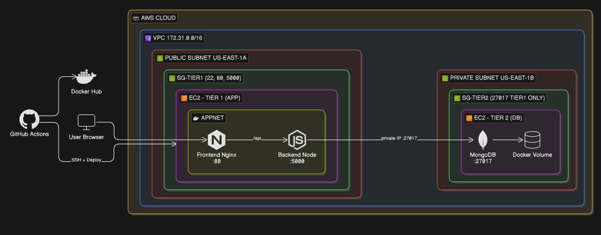
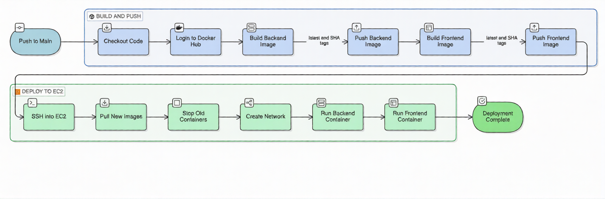

# 🚀 Two-Tier Web Application — DevOps Project

A production-grade two-tier web application deployed on AWS, demonstrating core DevOps skills including Docker, CI/CD with GitHub Actions, and cloud infrastructure on EC2.

---

## 🏗️ Architecture



---

## 🛠️ Tech Stack

| Layer | Technology |
|---|---|
| Frontend | React, Tailwind CSS, Nginx |
| Backend | Node.js, Express.js |
| Database | MongoDB (Docker container) |
| Containerization | Docker, Docker Hub |
| CI/CD | GitHub Actions |
| Cloud | AWS EC2 (Ubuntu 22.04, t2.micro) |
| Networking | AWS VPC, Public + Private Subnets, Security Groups |

---

## ✅ DevOps Skills Demonstrated

### Docker
- Multi-stage Dockerfile for frontend (Node build → Nginx serve)
- Production-hardened backend Dockerfile with non-root user
- `.dockerignore` to keep images clean and small
- Custom Docker network (`appnet`) for container-to-container communication
- Docker volumes for MongoDB data persistence

### CI/CD — GitHub Actions
- Triggered automatically on push to `main` branch
- Path filter — only triggers when files inside the project folder change
- Two-stage pipeline: `build-and-push` → `deploy-to-ec2`
- Docker images tagged with both `latest` and git SHA for versioning
- Secrets managed via GitHub Actions Secrets — no hardcoded credentials anywhere
- SSH deployment to EC2 using `appleboy/ssh-action`

### AWS
- Two separate EC2 instances — one per tier
- Tier 1 in a public subnet — accessible by users
- Tier 2 in a private subnet — no public IP, unreachable from the internet
- Security groups restrict port 27017 to Tier 1 private IP only
- All DB traffic stays inside the VPC, never touches the public internet

### Security
- Database EC2 has no public IP — isolated in a private subnet
- Backend container runs as non-root user (`appuser`)
- Secrets injected at runtime via environment variables
- `.gitignore` and `.dockerignore` prevent leaking sensitive files
- MongoDB port 27017 restricted to Tier 1 private IP only

### Nginx
- Serves React static files
- Proxies `/api/*` requests to the backend container
- `try_files` directive for React client-side routing

---

## 📁 Project Structure

```
1-Two-Tier-WebApp/
├── .github/
│   └── workflows/
│       └── deploy.yml          # CI/CD pipeline
├── backend/
│   ├── server.js               # Express API
│   ├── package.json
│   ├── package-lock.json
│   ├── Dockerfile              # Production-hardened, non-root user
│   └── .dockerignore
├── frontend/
│   ├── src/
│   │   └── App.jsx             # React counter app
│   ├── public/
│   ├── nginx.conf              # Nginx proxy config
│   ├── package.json
│   ├── package-lock.json
│   ├── Dockerfile              # Multi-stage build
│   └── .dockerignore
└── README.md
```

---

## ⚙️ CI/CD Pipeline



**Pipeline duration: ~1 min 20 sec** from push to live deployment.

---

## 🔐 GitHub Secrets Required

| Secret | Description |
|---|---|
| `DOCKER_HUB_USERNAME` | Docker Hub username |
| `DOCKER_HUB_ACCESS_TOKEN` | Docker Hub access token |
| `EC2_HOST` | Public IP of Tier 1 EC2 |
| `EC2_USER` | EC2 username (`ubuntu`) |
| `EC2_SSH_KEY` | Private `.pem` key content |
| `DB_PRIVATE_IP` | Private IP of Tier 2 EC2 |

---

## 🚀 How to Run Locally

1. Clone the repo:
```bash
git clone https://github.com/zmFAWZI/DevOps-Ziad-Projects.git
cd DevOps-Ziad-Projects/1-Two-Tier-WebApp
```

2. Create `backend/.env`:
```
MONGO_URI=mongodb://localhost:27017/devops_db
PORT=5000
```

3. Run MongoDB locally:
```bash
docker run -d -p 27017:27017 mongo:latest
```

4. Run backend:
```bash
cd backend && npm install && node server.js
```

5. Run frontend:
```bash
cd frontend && npm install && npm start
```

---

## 📌 Key Decisions

**Why two EC2 instances?**
Separating the app and database tiers mirrors real production architecture. The database is isolated on its own instance in a private subnet with no public IP.

**Why private subnet for the database?**
A private subnet has no internet gateway — even if the security group was misconfigured, the database would still be unreachable from the internet. Defense in depth.

**Why Docker network instead of docker-compose?**
In a two-EC2 setup, docker-compose can't span multiple machines. A custom Docker network (`appnet`) on the app EC2 allows the frontend and backend containers to communicate by container name.

**Why non-root user in backend Dockerfile?**
Running as root inside a container is a security risk. If the container is compromised, an attacker would have root access. A dedicated `appuser` limits the blast radius.

**Why tag images with git SHA?**
`latest` always points to the newest image, but the SHA tag gives a traceable history — we can roll back to any previous deployment by its exact commit.


---

## 🔗 Connect

[](https://linkedin.com/in/ziad-m-fawzi-abdalla-6a075a328)
[](https://github.com/zmFAWZI)
